# 웹 포트폴리오 리뉴얼 결과 매핑 보고서

## 1. 개요 및 리뉴얼 전략

웹 포트폴리오의 리뉴얼은 '나를 모르는 사람들'을 중심으로 구조를 설계하여 간결하고 핵심적으로 자신을 잘 표현하는 것을 목표로 합니다. 정보 과부하를 해소하기 위해 **랜딩 페이지 - 프로필 페이지 - 프로젝트 아카이브**의 3단 구조를 채택했습니다.

| 항목 | 상세 내용 |
| :--- | :--- |
| **핵심 목적** | 방문자가 개발자에 대해 간결하고 핵심적으로 이해하도록 구조를 설계하는 것 |
| **시각적 방향** | 시각적으로 화려하지 않으면서 임팩트 있는 방향을 추구하며, 내용은 간결하고 직관적이며 이해가 잘 되도록 설계 |
| **글로벌 메뉴 전략** | 방문자에게 **메뉴 전환**이 가장 중요하므로, 메뉴 위치를 변경하여 전면에 잘 보이도록 수정하는 것이 권장됨 |

## 2. 랜딩 페이지 (Landing Page) 피드백 반영

### 2.1 히어로 섹션 개선

**이전 피드백**: 첫 진입 시 임팩트 부족 및 배경(테트리스) 상징성 불분명. **브랜드 이미지 부각** 필요

**이전 상태 (Before)**:
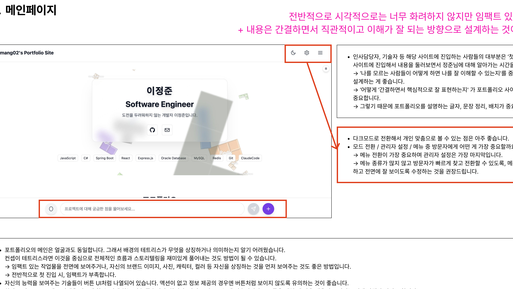

**리뉴얼 반영**: 새로운 히어로 섹션에서 배경이 깔끔하게 정리되었고, 고유한 색상 및 패턴을 활용하여 시각적 임팩트와 브랜딩을 확보함

**리뉴얼 후 (After)**:

### 2.2 기술 스택 UI 개선

**이전 피드백**: **기술 스택이 버튼 UI처럼 보임** (액션 없음). 액션 없는 UI 지양

**이전 상태 (Before)**:
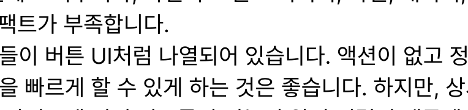

**리뉴얼 반영**: `에이전틱 코딩` 섹션의 기술 설명 부분이 **액션 없는 정보 나열 박스** 형태로 구성되어 불필요한 인터랙티브 UI를 제거함

**리뉴얼 후 (After)**:
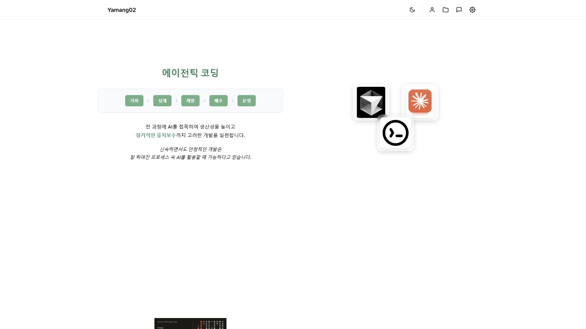

### 2.3 CTA 섹션 추가

**이전 피드백**: 하단 고정 기능이 상시 고정으로 눈에 거슬리고 **첫 방문자에게 비효율적일 수 있음**

**이전 상태 (Before)**:
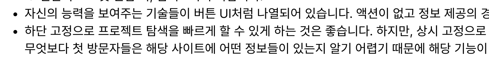

**리뉴얼 반영**: 랜딩 페이지 하단에 **'더 알아보기' CTA 섹션**을 통해 **'프로필 보기'**와 **'프로젝트 보기'** 버튼을 명확히 제시하여 사용자가 능동적으로 다음 페이지로 진입하도록 유도함

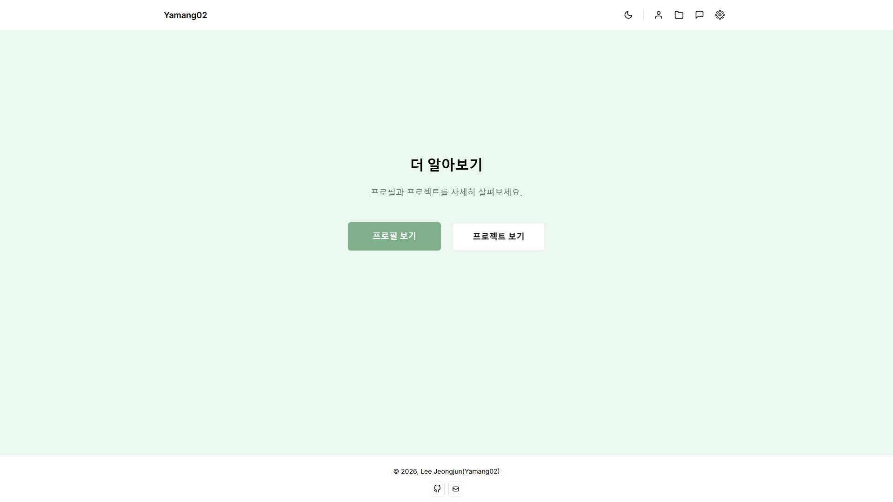

## 3. 프로필 페이지 (Profile Page) 피드백 반영

### 3.1 이력 정보 구조화

**이전 피드백**: 경력/교육/자격증은 **간결한 나열식**으로 구성하고 **큰 영역을 차지할 필요가 없음**

**리뉴얼 반영**: **'이정준 Profile' 페이지**를 신설하여 이력 정보를 분리함. 경력(Work) 및 기타 경험(Other Experience) 섹션이 **간결한 나열 형식**으로 구성됨

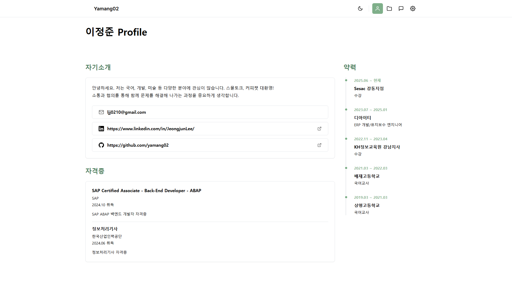

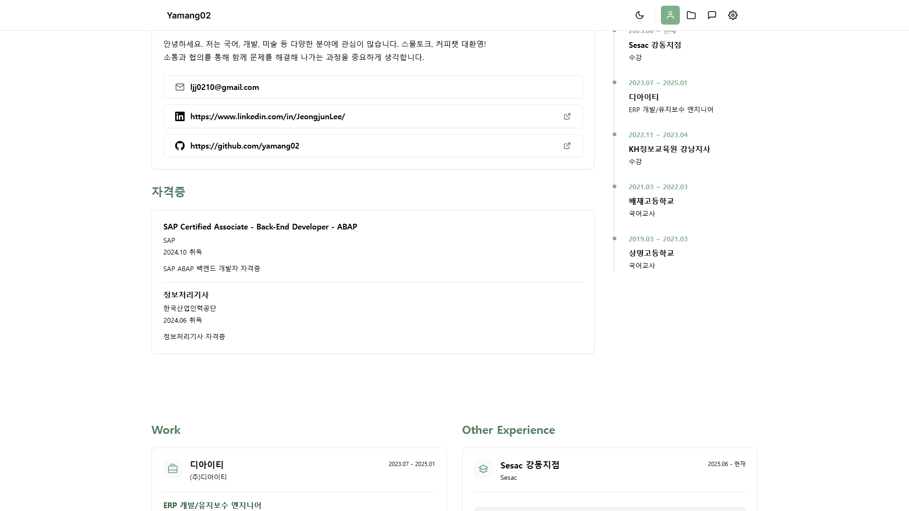

### 3.2 자격증 섹션 UI 개선

**이전 피드백**: 액션이 없는 항목(자격증 등)에 **호버 포커싱 지양** 및 **정보 나열식 UI** 권장

**리뉴얼 반영**: '자격증' 섹션은 호버 포커싱 없이 **심플한 정보 나열식**으로 구성됨. 정보의 중요도에 따라 글자 크기, 굵기 등을 활용하는 방식이 적용됨

### 3.3 프로젝트 히스토리 위치 개선

**이전 피드백**: **AI 메시지 필드 쪽 프로젝트 히스토리** 경로가 어색함. 경력 혹은 프로젝트 섹션 그룹으로 묶어야 함

**이전 상태 (Before)**:
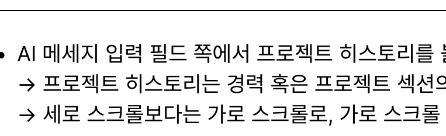

**리뉴얼 반영**: 프로젝트 히스토리는 별도의 섹션이 아닌, **경력(Work) 및 기타 경험(Other Experience) 섹션**과 함께 배치되어 관련 정보의 흐름이 자연스럽게 연결되도록 구성함

## 4. 프로젝트 아카이브 (Archive) 피드백 반영

### 4.1 검색 필터 간소화

**이전 피드백**: **검색 필터가 너무 많아** 당혹스러움. **간결하게 제공** 필요

**이전 상태 (Before)**:
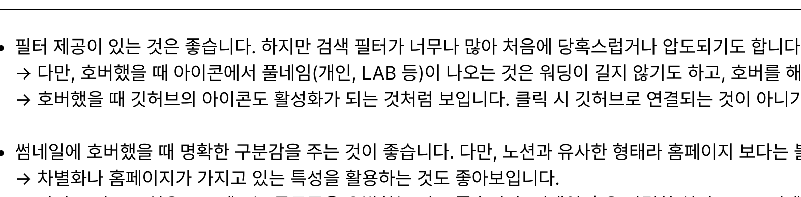

**리뉴얼 반영**: **타임라인 UI**와 **4가지 명확한 섹션**(Featured Projects, MAINTENANCE, BUILD, LAB)을 통해 프로젝트 목록을 구조화하여, 복잡한 필터 없이도 체계적인 탐색이 가능해짐

**리뉴얼 후 (After)**:
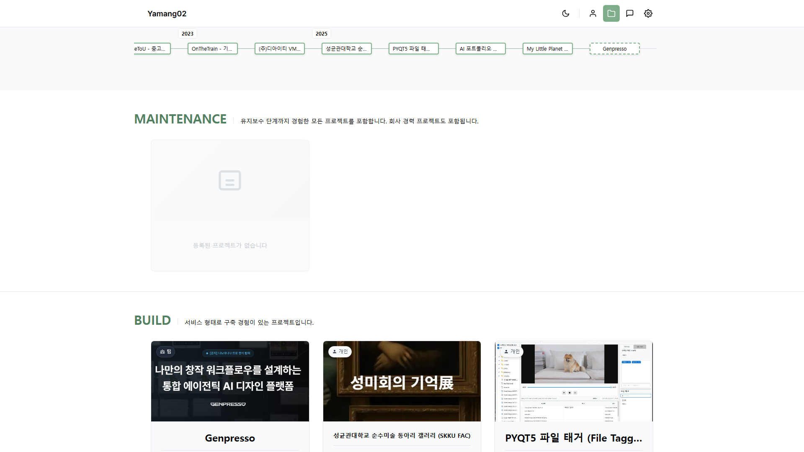

### 4.2 프로젝트 카드 디자인 차별화

**이전 피드백**: 썸네일 호버 시 **노션 유사 형태 지양** 및 **차별화된 디자인** 활용 권장

**리뉴얼 반영**: 프로젝트 목록 카드가 상세 이미지와 함께 프로젝트 개요를 보여주는 깔끔한 카드 디자인으로 구성되어, **홈페이지 특성을 살린 차별화**를 시도함

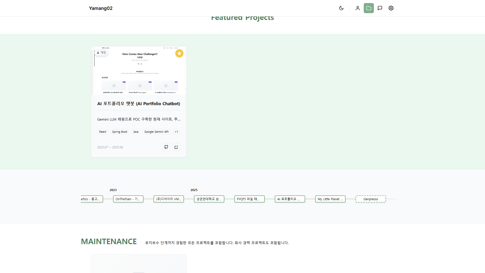

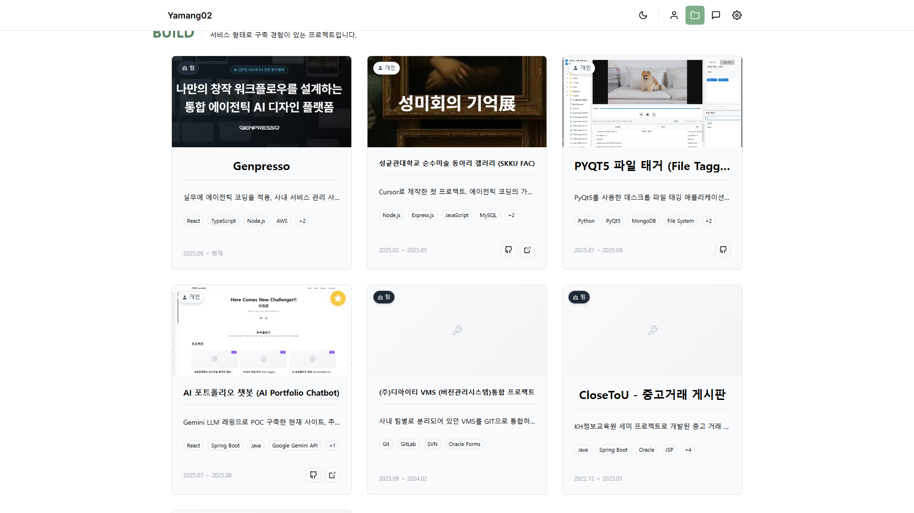

### 4.3 불필요한 인터랙션 제거

**이전 피드백**: 호버했을 때 깃허브 아이콘 등이 활성화되지만 **클릭 연결이 없는 아이콘 변화**는 불필요

**리뉴얼 반영**: 프로젝트 카드 내의 기술 스택 아이콘은 **액션 없이 정보 나열**을 지향하도록 구성되어 불필요한 시각적 변화가 최소화됨

## 5. 상세 페이지 및 AI 비서 피드백 반영

### 5.1 상세 페이지 레이아웃 개선

**이전 피드백**: **왼쪽 고정 메뉴**로 상세 내용이 잘려 보임. **영역 축소/숨김** 권장

**이전 상태 (Before)**:
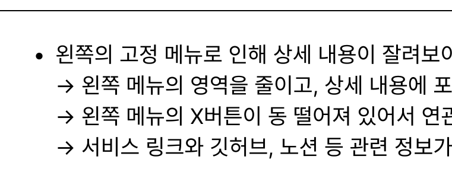

**리뉴얼 반영**: 상세 페이지는 고정된 왼쪽 메뉴 대신 **'목차' 박스**가 콘텐츠 영역 내에 배치되어 **내용 잘림 현상 없이** 정보를 제공함

**리뉴얼 후 (After)**:
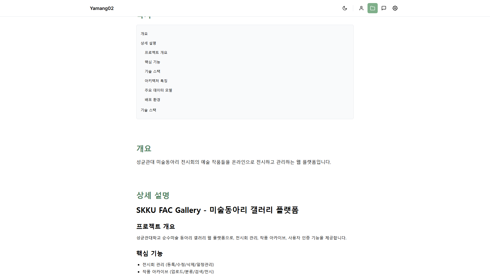

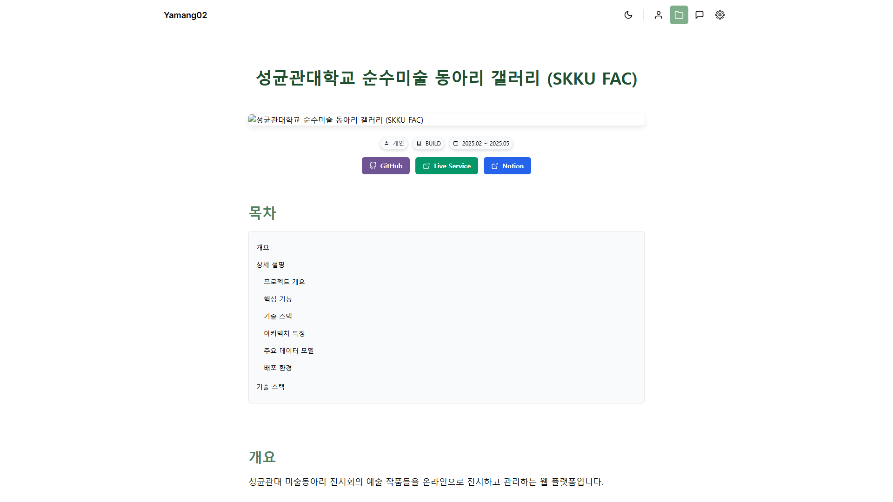

### 5.2 헤더 최적화

**이전 피드백**: 상세 내용에서 **방해되는 요소 최소화**. 타이틀 상시 점유 방지

**리뉴얼 반영**: 상세 페이지 헤더에 **프로젝트 명, 기간, 핵심 액션 버튼**(GitHub, Live Service, Notion)만 컴팩트하게 배치되어, 내용 본문에 대한 집중도를 높임

### 5.3 AI 비서 컨셉 명확화

**이전 피드백**: AI 비서 기능의 **뚜렷한 목표 설정 및 컨셉화** 필요

**이전 상태 (Before)**:
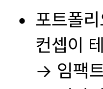

**리뉴얼 반영**: AI 비서 인터페이스에서 **"저는 AI 포트폴리오 비서입니다"**라고 명확히 정의하고, **예시 질문**을 제공하여 방문자에게 기능의 목표와 유용성을 명확히 전달함

**리뉴얼 후 (After)**:
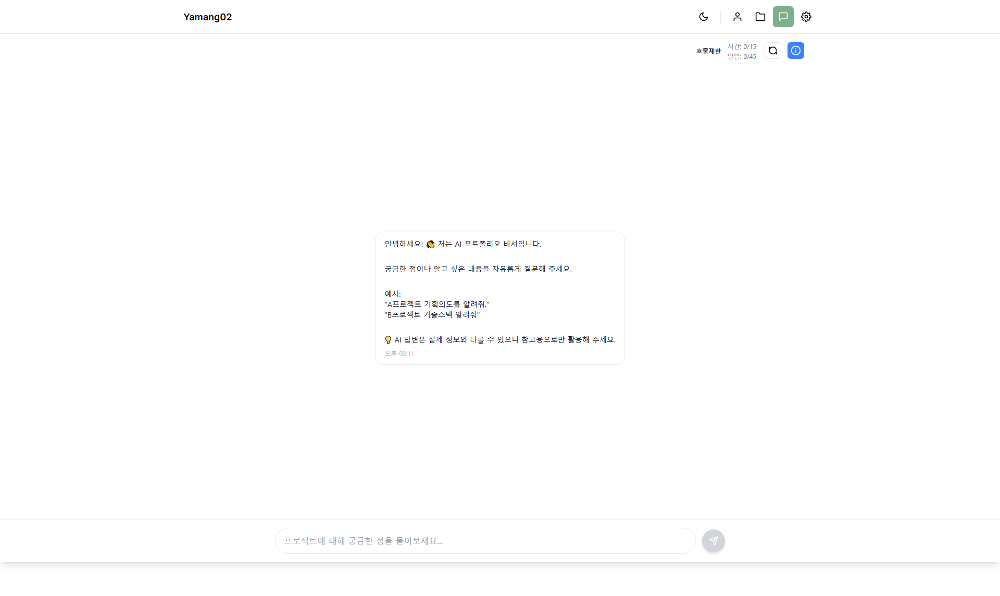

## 6. 리뷰와 무관한 새로운 구조적 요소

### 6.1 프로젝트 아카이브 분류

프로젝트 목록이 **Featured Projects, MAINTENANCE, BUILD, LAB** 등 4가지 명확한 섹션으로 구분되어, 프로젝트의 **상태 및 성격**에 따라 정보를 체계적으로 분류함.

### 6.2 아카이브 타임라인

상단에 **연도별 타임라인 UI**가 배치되어, 방문자가 프로젝트의 **시간적 흐름**을 한눈에 파악하기 쉬움.

### 6.3 글로벌 내비게이션

우측 상단에 '프로필', '채팅', '설정' 등 아이콘이 직관적으로 배치되어 있으며, 이는 **메뉴 전환의 중요성**을 최우선으로 둔 전략을 반영함.

## 7. 참고 자료

### 스크린샷 파일 위치
모든 스크린샷 파일은 다음 경로에 위치합니다:
- `./screenshots/` (문서와 같은 디렉토리의 screenshots 폴더)

### 주요 스크린샷 파일 목록

#### 리뉴얼 후 (After)
- `landing-hero.png` - 랜딩 페이지 히어로 섹션
- `landing-about.png` - 랜딩 페이지 About 섹션
- `landing-featured-projects.png` - 랜딩 페이지 Featured Projects
- `landing-cta.png` - 랜딩 페이지 CTA 섹션
- `profile-intro.png` - 프로필 페이지 인트로
- `profile-timeline.png` - 프로필 페이지 타임라인
- `archive-timeline.png` - 아카이브 타임라인
- `archive-featured.png` - 아카이브 Featured 섹션
- `archive-build-section.png` - 아카이브 BUILD 섹션
- `responsive-mobile-archive.png` - 모바일 반응형 아카이브
- `project-detail-content.png` - 프로젝트 상세 페이지 콘텐츠
- `project-detail-header.png` - 프로젝트 상세 페이지 헤더
- `chat-full.png` - AI 채팅 페이지

#### 리뉴얼 전 (Before)
- `before/pdf/pdf-mainpage-impact.png` - (PDF 발췌) 메인페이지 임팩트/브랜딩 피드백
- `before/pdf/pdf-stack-buttons.png` - (PDF 발췌) 기술 스택 버튼 UI 오해 피드백
- `before/pdf/pdf-bottom-fixed.png` - (PDF 발췌) 하단 고정 UI 피드백
- `before/pdf/pdf-project-history.png` - (PDF 발췌) 프로젝트 히스토리 동선 피드백
- `before/pdf/pdf-filters-hover.png` - (PDF 발췌) 검색 필터/호버/아이콘 피드백
- `before/pdf/pdf-detail-sidebar.png` - (PDF 발췌) 상세페이지 좌측 고정 메뉴 피드백
- `before/pdf/pdf-ai-assistant.png` - (PDF 발췌) AI 비서 컨셉/목표 피드백

---

**작성일**: 2025년 1월  
**문서 버전**: 1.0
